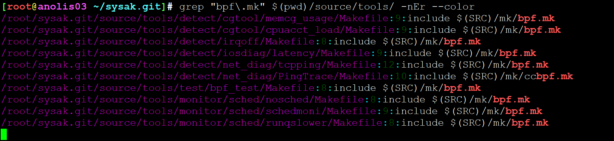
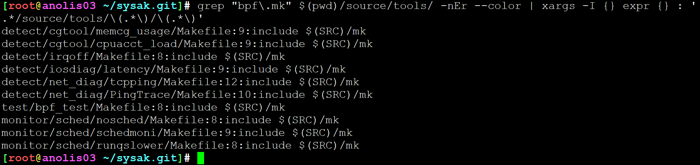
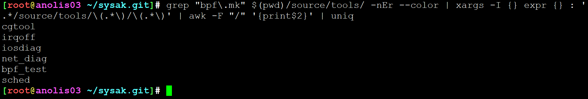
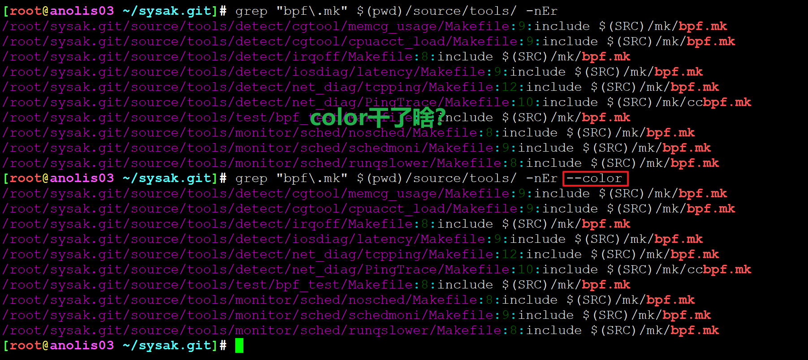
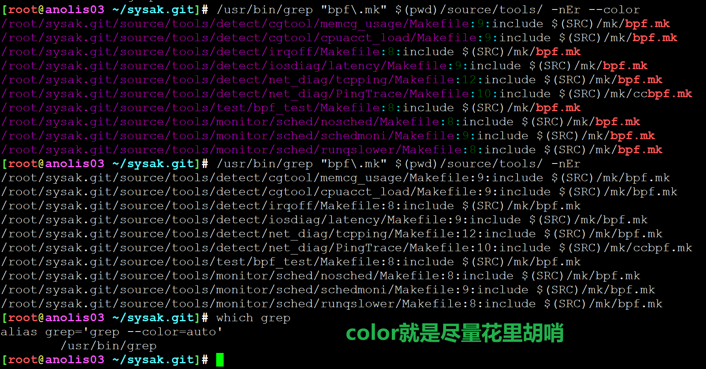
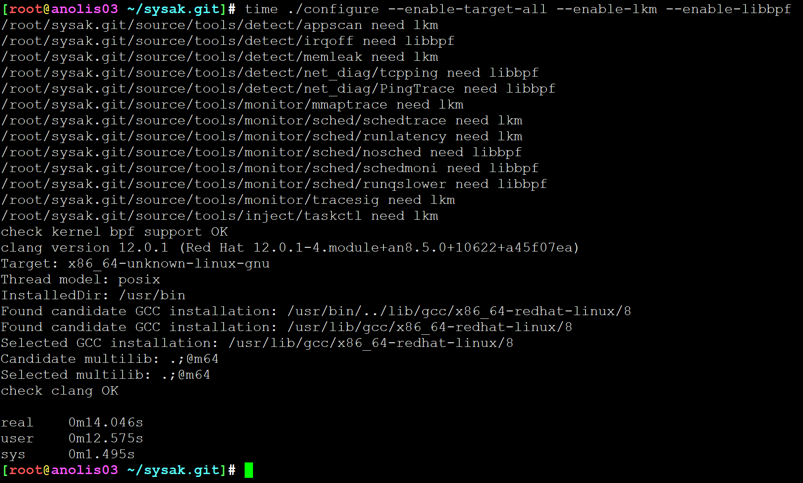
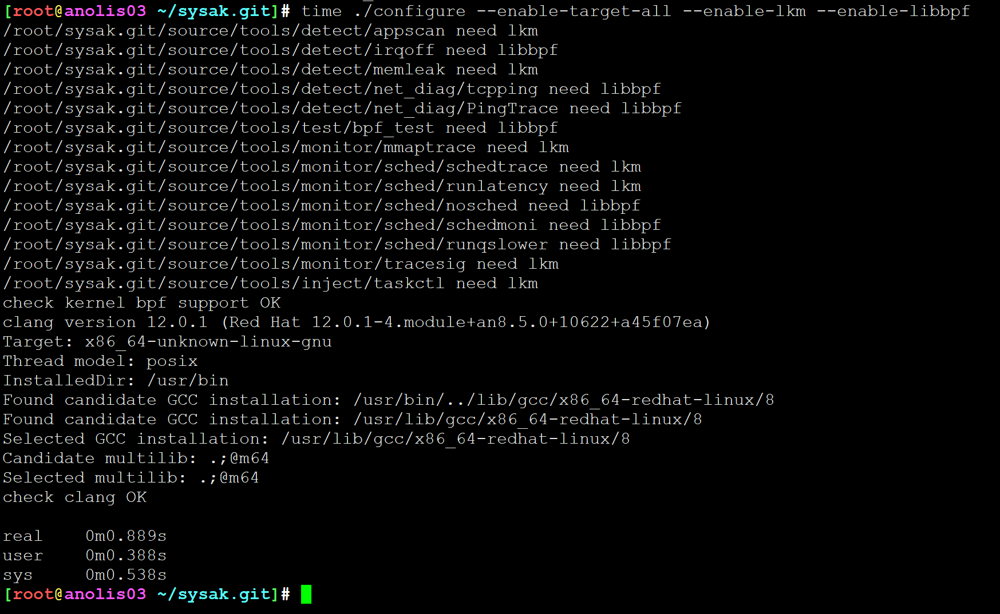

# configure

```
[root@anolis03 ~/sysak.git]# cat configure
#!/bin/bash
# 推荐直接bash，因为你的规则是bash，若是zsh会爆炸。sh是系统默认软链。
#set -x
config_host_mak="config-host.mak"

kern_ver=`uname -r`
objdir=$(pwd)/out
enable_lkm=NO
enable_libbpf=NO
disable_libbpf=NO
static_link=no
enable_all=no
default_target=yes
kernel_bpf_support=NO
disable_list=test

# help辅助函数
usage() {
	echo "Usage: configure [options]"
	echo "options:"
	echo "  --kernel=KERNEL_VERSION    kernel version"
	echo "  --buiddir=OBJDIR           the build dir"
	echo "  --enable-lkm               enable linux kernel module"
	echo "  --enable-libbpf            enable libbpf"
	echo "  --disable-libbpf           disable all bpf tools"
	echo "  --enable-static            static link for c/cpp tools"
	echo "  --enable-target-xxx        xxx is the actual tool, like memleak, you may use --show-target to list all" # may是认真的？
	echo "  --enable-target-all        enable all compoents"
	echo "  --disable-default          disable default compoents to built-in"
	echo "  --disable-target-xxx       xxx is the actual tool, like memleak, you may use --show-target to list all"
	echo "  --show-target              list all support tools"
}

# 检查内核是否支持bpf
check_bpf_kernel() {
  # 4.19.91-23.4.an8.x86_64
	kern_major=$(echo $kern_ver | awk -F '.' '{print $1}')
	kern_minor=$(echo $kern_ver | awk -F '.' '{print $2}')
	is_centos7=$(echo $kern_ver | grep el7 | wc -l)
  # 主版本号>4 并且 次版本号>4 则内核默认支持
	if [ $((kern_major)) -ge 4 -a $((kern_minor)) -ge 4 ]; then
		kernel_bpf_support="YES"
	fi

	if [ $is_centos7 = 1 ]; then
    # centos匹配规则，仅次版本号大于957才支持bpf充分
		centos_minor=$(echo $kern_ver | awk -F '-' '{print $2}' | awk -F '.' '{print $1}')
		if [ $((centos_minor)) -ge 957 ];then
			kernel_bpf_support="YES"
		fi
	fi

	if [ $kernel_bpf_support != "YES" ];then
    # 若需要检测bpf，则强制要求内核充分支持，否则fatal error
		echo "this kernel version not support ebpf"
		exit 1
	else
		echo "check kernel bpf support OK"
	fi
}

# 检查编译bpf的依赖，即内核支持且clang存在，脚本用的"倒叙写法"
check_bpf_depend() {
	check_bpf_kernel
	if [ $kernel_bpf_support = "YES" ];then
		clang -v > /dev/null
		if [ $? = 0 ];then   # if which clang &> /dev/null ; then echo ok else echo bad ;fi
			echo "check clang OK"
		else
			echo "check clang failed, should intall first"
			exit 1
		fi
	fi
}

# 检查内核开发包是否安装
check_lkm_depend() {
	rpm -q kernel-devel-$kern_ver > /dev/null
	if [ $? != 0 ];then   # if rpm -q kernel-devel-$kern_ver > /dev/null ; XXX fi 简写真香
		echo "check kernel-devel-$kern_ver failed, should intall first"
		exit 1;
	fi
}

# 检查依赖，根据关系分别check 内核开发包及bpf依赖
check_depend() {
	if [ $enable_lkm = "YES" ]; then
		check_lkm_depend
	fi
	if [ $enable_libbpf = "YES" ]; then
		check_bpf_depend
	fi
}

# 上述都是shell函数，shell真正开始执行从这里开始，先判断选项
for opt; do
	optarg=$(expr "x$opt" : 'x[^=]*=\(.*\)')
	case "$opt" in
		--kernel=*)
			kern_ver=$optarg
			;;
		--buiddir=*)
			objdir=$(readlink -f $optarg)
			;;
		--enable-lkm)
			enable_lkm="YES"
			;;
		--enable-libbpf)
			enable_libbpf="YES"
			;;
		--disable-libbpf)
			disable_libbpf="YES"
			;;
		--enable-static)
			static_link="yes"
			;;
		--enable-target-*)
			target=$(expr "$opt" : '--enable-target-\(.*\)')
			if [ $target = "all" ]; then
				enable_all="yes"
			else
				target_list="$target $target_list"
			fi
			;;
		--disable-default)
			default_target=no
			;;
		--disable-target-*)
			disable=$(expr "$opt" : '--disable-target-\(.*\)')
			disable_list="$disable|$disable_list"
			;;
		--show-target)
			#grep -nrw "target :=" $(pwd)/source/tools/ | awk '{print $3}' | grep -v test
			find $(pwd)/source/tools/ -name Makefile -exec grep -H 'target :=' {} \; | awk '{print $3}' | grep -v test
			exit
			;;
		*)
			usage
			exit
			;;
	esac
done

if [ $static_link = "yes" ]; then
echo "EXTRA_LDFLAGS = --static" >> $config_host_mak
fi

if [ $default_target = "yes" ]; then
  target_list="tcp_syn_drop cpuirq sysmonitor cpu_flamegraph $target_list"
fi
for i in $target_list;do
	#target_files="$(grep -nrw "target := $i" $(pwd)/source/tools/ | awk -F ":" '{print $1}') $target_files"
	target_files="$(find $(pwd)/source/tools/ -name Makefile -exec grep -H "target := ${i}" {} \; | awk -F ":" '{print $1}') $target_files"
done

if [ $disable_libbpf = "YES" ]; then
  #disable_target=$(grep "bpf\.mk" $(pwd)/source/tools/ -nEr --color | xargs -I {} expr {} : '.*/source/tools/\(.*\)/\(.*\)' | awk -F "/" '{print$2}' | uniq)
  disable_target=$(find $(pwd)/source/tools/ -name Makefile -exec grep -H 'bpf\.mk' {} \; | xargs -I {} expr {} : '.*/source/tools/\(.*\)/\(.*\)' | awk -F "/" '{print$2}' | uniq)
  for single_target in $disable_target;do
    # 用 '|' 拼接，后续grep -E 正则可以做到 或 的效果
    disable_list="$single_target|$disable_list"
  done
fi

if [ $enable_all = "yes" ]; then
  #target_files=$(grep -nrw "target :=" $(pwd)/source/tools/ | grep -vwE $disable_list | awk -F ":" '{print $1}')
  # 此处需求还是一行写就太长了，显的臃肿，建议拆分
  # 需求是将匹配的target过滤掉，保留剩下的文件列表，用空格隔开也可
  for  mk in `find $(pwd)/source/tools/ -name Makefile -exec grep -l "target :=" {} \; `;do
    if ! grep -wE "target := ${disable_list}" $mk ;then
      target_files="${target_files} $mk"
    fi
  done
fi

# 目标文件列表，挨个遍历，获取目录。又是grep，遍历目录内容检索是否包含modin\bpf.mk
# 这位开发者很喜欢grep -r啊。。。每个grep都必须有-r
for file in $target_files;do
  target_path=$(dirname $file)
  target_paths="$target_path $target_paths"
  grep -nrw modin $file > /dev/null
  if [ $? = 0 ]; then
  	enable_lkm="YES"
  	echo "$target_path need lkm"
  fi
  grep -nr "bpf.mk" $file > /dev/null
  if [ $? = 0 ]; then
  	enable_libbpf="YES"
  	echo "$target_path need libbpf"
  fi
done

check_depend
echo "# Automatically generated by configure - do not modify" > $config_host_mak
echo "KERNEL_VERSION = $kern_ver" >> $config_host_mak
echo "OBJPATH = $objdir" >> $config_host_mak
echo "BUILD_KERNEL_MODULE = $enable_lkm" >> $config_host_mak
echo "BUILD_LIBBPF = $enable_libbpf" >> $config_host_mak
echo "TARGET_LIST = $target_paths" >> $config_host_mak
```













优化性能比较:

 



---
