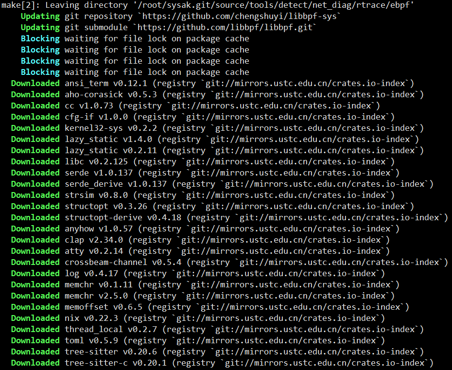
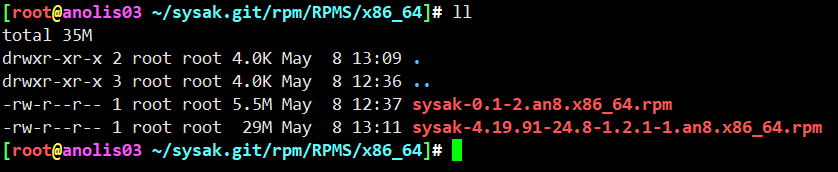
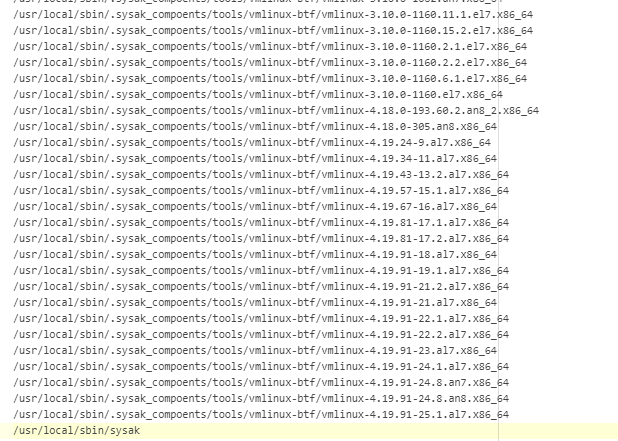
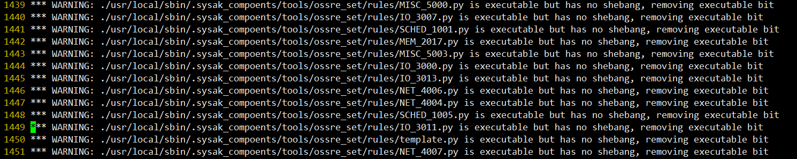
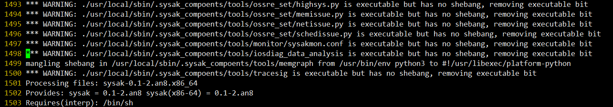
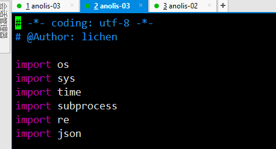
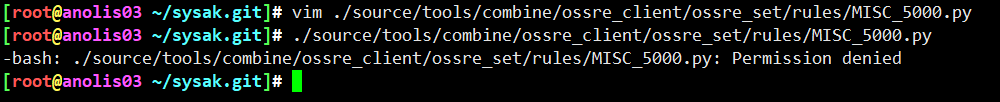
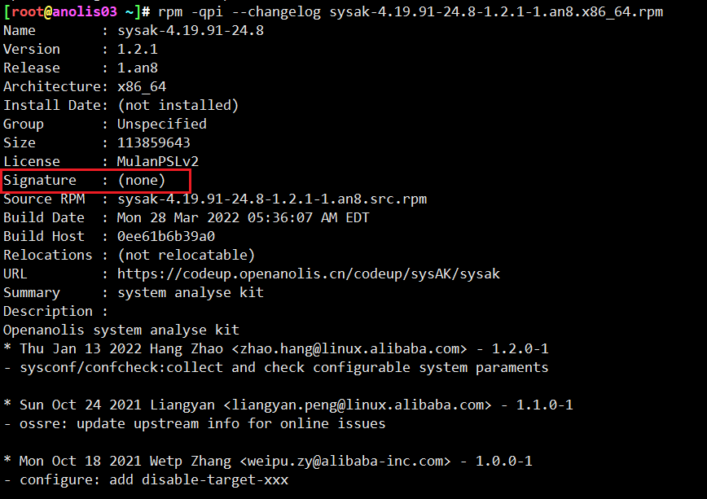
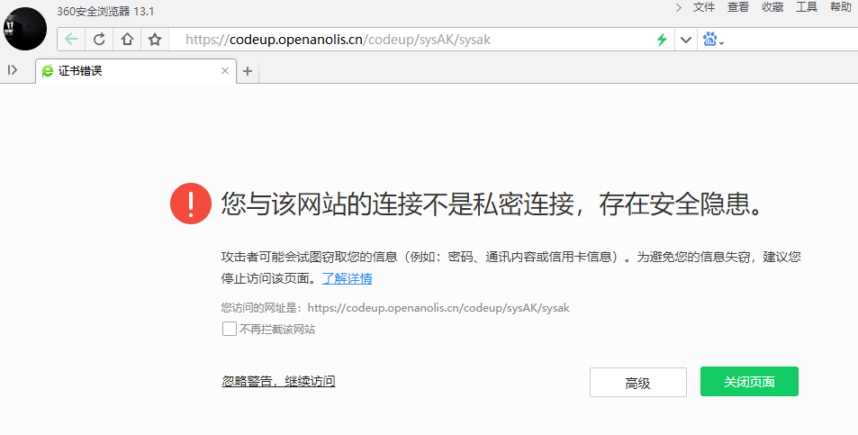
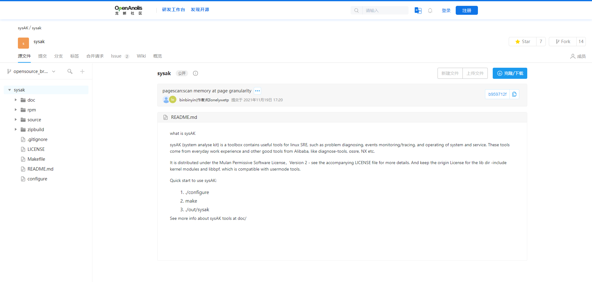

<!-- MDTOC maxdepth:6 firsth1:1 numbering:0 flatten:0 bullets:1 updateOnSave:1 -->

- [构建rpm包](#构建rpm包)   
   - [详细采坑](#详细采坑)   
   - [一键直达](#一键直达)   
   - [二进制包内容](#二进制包内容)   
   - [安装测试](#安装测试)   
   - [对比](#对比)   
   - [rpm构建遇到的问题](#rpm构建遇到的问题)   

<!-- /MDTOC -->
# 构建rpm包

## 详细采坑


rpm包构建脚本在```rpm/sysak-build.sh```


脚本运行需要两个参数，分别用来定义rpm包的版本号以及发布版本号


直接走你，应该有很多依赖，没有文档列出。咱们来一步一步采坑


```
yum install -y clang
```


```
yum install -y make automake cmake
```


```
yum install -y elfutils-libelf-devel
```


```
yum install -y llvm
```


```
yum install -y cargo
```




联网下载什么东西来着,cargo下载比较慢，更新一下软件源...

```
cat > ~/.cargo/config << EOF

[source.crates-io]
#registry = "https://github.com/rust-lang/crates.io-index"

# 替换成你偏好的镜像源
replace-with = 'ustc'
#replace-with = 'sjtu'

# 清华大学
[source.tuna]
registry = "https://mirrors.tuna.tsinghua.edu.cn/git/crates.io-index.git"

# 中国科学技术大学
[source.ustc]
registry = "git://mirrors.ustc.edu.cn/crates.io-index"

# 上海交通大学
[source.sjtu]
registry = "https://mirrors.sjtug.sjtu.edu.cn/git/crates.io-index"

# rustcc社区
[source.rustcc]
registry = "git://crates.rustcc.cn/crates.io-index"
EOF
```


缺失CLI，查看 ： ```source/tools/detect/net_diag/PingTrace/README.md```

```
环境依赖
安装log4cpp库
下载链接： https://sourceforge.net/projects/log4cpp/files/log4cpp-1.1.x%20%28new%29/log4cpp-1.1/log4cpp-1.1.3.tar.gz/download
tar -xzf log4cpp-1.1.3.tar.gz -C ./
cd log4cpp && ./configure && make && make install
安装rapidjson库
git clone https://github.com/Tencent/rapidjson.git
git submodule update --init
mkdir build && cd build && cmake .. && make install
安装CLI11库
git clone https://github.com/CLIUtils/CLI11.git
git checkout 34c4310d9907f6a6c2eb5322fa7472474800577c
git submodule update --init
mkdir build && cd build && cmake .. && make install
```


```
[root@anolis03 ~]# md5sum log4cpp-1.1.3.tar.gz
b9e2cee932da987212f2c74b767b4d8b  log4cpp-1.1.3.tar.gz
```

```
wget -c https://nchc.dl.sourceforge.net/project/log4cpp/log4cpp-1.1.x%20%28new%29/log4cpp-1.1/log4cpp-1.1.3.tar.gz
tar -xzf log4cpp-1.1.3.tar.gz -C ./
cd log4cpp && ./configure && make && make install


git clone https://gitee.com/wuhao1938/rapidjson.git
cd rapidjson && \
  sed -i "s#https://github.com/google/googletest.git#https://gitee.com/huey97/googletest#g"  .gitmodules && \
  git submodule update --init
mkdir build && cd build && cmake .. && make install


git clone https://gitee.com/sidneysun/CLI11.git
cd CLI11 && \
  git checkout 34c4310d9907f6a6c2eb5322fa7472474800577c && \
  sed -i "s#../../google/googletest.git#https://gitee.com/huey97/googletest#g"  .gitmodules && \
  git submodule update --init && \
  mkdir build && cd build && cmake .. && make install
```


```
yum install -y ncurses-devel
```


pingtrace是静态连接的


怪不得ncurses已经装了开发包也没卵用


```
# -lc -lm -lpthread -ldl
yum install glibc-static -y
```


```
# -lstdc++
yum install -y libstdc++-static
```


```
# -lz
yum install -y zlib-static
```


没有直接的static包，估计编译了没放进去，尝试获取源码编译一下

```
yum update -y anolis-repos
sed -i 's/enabled=0/enabled=1/g' /etc/yum.repos.d/*.repo
yum makecache
cd
yumdownloader --source ncurses-libs
rpm -ivh ncurses-*.src.rpm
cd ~/rpmbuild
yum builddep -y SPECS/*
rpmbuild -ba SPECS/*
rpm -ivh /root/rpmbuild/RPMS/x86_64/ncurses-static-6.1-9.20180224.an8.x86_64.rpm
```


* 软件源里没有这个静态库，说明龙蜥的软件源，可能存在包不全的情况，既然编译了为啥不提供


elf也是只安装了动态库，找找有没有静态库，没有就老规矩重新编译


```
yum install -y elfutils-devel-static.x86_64 elfutils-libelf-devel-static.x86_64
```


成功编译


```
sysak-0.1-2.an8.x86_64.rpm  # 0.1版本，2发布，正常，符合预期
```


## 一键直达

```
#!/bin/bash

set -x

yum update -y anolis-repos
sed -i 's/enabled=0/enabled=1/g' /etc/yum.repos.d/*.repo
yum makecache
yum install -y clang make automake elfutils-libelf-devel \
  llvm cargo cmake ncurses-devel glibc-static \
  libstdc++-static zlib-static \
  elfutils-devel-static.x86_64 elfutils-libelf-devel-static.x86_64

cat > ~/.cargo/config << EOF

[source.crates-io]
#registry = "https://github.com/rust-lang/crates.io-index"

# 替换成你偏好的镜像源
replace-with = 'ustc'
#replace-with = 'sjtu'

# 清华大学
[source.tuna]
registry = "https://mirrors.tuna.tsinghua.edu.cn/git/crates.io-index.git"

# 中国科学技术大学
[source.ustc]
registry = "git://mirrors.ustc.edu.cn/crates.io-index"

# 上海交通大学
[source.sjtu]
registry = "https://mirrors.sjtug.sjtu.edu.cn/git/crates.io-index"

# rustcc社区
[source.rustcc]
registry = "git://crates.rustcc.cn/crates.io-index"
EOF


cd
wget -c https://nchc.dl.sourceforge.net/project/log4cpp/log4cpp-1.1.x%20%28new%29/log4cpp-1.1/log4cpp-1.1.3.tar.gz
tar -xzf log4cpp-1.1.3.tar.gz -C ./
cd log4cpp && ./configure && make && make install
cd
git clone https://gitee.com/wuhao1938/rapidjson.git
cd rapidjson && \
  sed -i "s#https://github.com/google/googletest.git#https://gitee.com/huey97/googletest#g"  .gitmodules && \
  git submodule update --init
mkdir build && cd build && cmake .. && make install
cd
git clone https://gitee.com/sidneysun/CLI11.git
cd CLI11 && \
  git checkout 34c4310d9907f6a6c2eb5322fa7472474800577c && \
  sed -i "s#../../google/googletest.git#https://gitee.com/huey97/googletest#g"  .gitmodules && \
  git submodule update --init && \
  mkdir build && cd build && cmake .. && make install
cd
yumdownloader --source ncurses-libs
rpm -ivh ncurses-*.src.rpm
cd ~/rpmbuild
yum builddep -y SPECS/*
rpmbuild -ba SPECS/*
rpm -ivh /root/rpmbuild/RPMS/x86_64/ncurses-static-6.1-9.20180224.an8.x86_64.rpm

```

## 二进制包内容

```
[root@anolis03 ~/sysak.git/rpm/RPMS/x86_64]# rpm -ql sysak-0.1-2.an8.x86_64.rpm
/usr/lib/.build-id
/usr/lib/.build-id/02
/usr/lib/.build-id/02/4db138c2a98a23c98cf2170f3ae9c63151ea47
/usr/lib/.build-id/05
/usr/lib/.build-id/05/e23e39adab7287aff36ac53a6ae0a145bce4fd
/usr/lib/.build-id/09
/usr/lib/.build-id/09/61cc2fe7d2e2d67b4f2c7c5cf04bc84a6c507d
/usr/lib/.build-id/12
/usr/lib/.build-id/12/4570f8a4f328b322bc799d667cb1bed075255a
/usr/lib/.build-id/12/eb9adf736baefd96e650156fca55b187ac4f62
/usr/lib/.build-id/16
/usr/lib/.build-id/16/a7eb6ef95122fdd304edb86fad0e10ac9c8db7
/usr/lib/.build-id/1c
/usr/lib/.build-id/1c/41cb331e1478fb30db156b298153b03fdb2eac
/usr/lib/.build-id/23
/usr/lib/.build-id/23/14750f80ab56c96985604cd6feeb5990876efe
/usr/lib/.build-id/23/a52f6af586274b1010ea80905f44da6642fc7f
/usr/lib/.build-id/35
/usr/lib/.build-id/35/b6034d1e04294193700b36c93435e0e508573f
/usr/lib/.build-id/37
/usr/lib/.build-id/37/95b163068a3d56b36b981a3d4cdd844a0cace4
/usr/lib/.build-id/48
/usr/lib/.build-id/48/4de7fb8259f1e5cb5c9369accf8ea1c4024258
/usr/lib/.build-id/4d
/usr/lib/.build-id/4d/c05f891173d4b2344daef1fc08b5ca9f67c747
/usr/lib/.build-id/51
/usr/lib/.build-id/51/59208d54c4760dfe6f13335359d5cc70135b3c
/usr/lib/.build-id/51/9c28ceb4a5b93d23f5f92773f6468ada8bfdac
/usr/lib/.build-id/55
/usr/lib/.build-id/55/382e0b2c5784d99992af6dc52c747cd4efdf1c
/usr/lib/.build-id/58
/usr/lib/.build-id/58/0d3171ce16111023c6ac7e33dcd23224081a2e
/usr/lib/.build-id/61
/usr/lib/.build-id/61/915a2740ae228295ae86e9796793d4b1f02824
/usr/lib/.build-id/6a
/usr/lib/.build-id/6a/537ce6ba4f1c0938e64db861fb13a6e722ea4a
/usr/lib/.build-id/6c
/usr/lib/.build-id/6c/fd9f6726a2684443af797b6782179b564e9278
/usr/lib/.build-id/71
/usr/lib/.build-id/71/5ed95b8c8b23ee376cfb3a80f166f1442b323d
/usr/lib/.build-id/73
/usr/lib/.build-id/73/a666b419d67263fa2cf95357488f3bd8b33b18
/usr/lib/.build-id/7b
/usr/lib/.build-id/7b/40f16476376d97fe19e3866b6da1d6f6f3194c
/usr/lib/.build-id/7f
/usr/lib/.build-id/7f/122855bbcc664e1e45090e15fcce68fdec4c7b
/usr/lib/.build-id/81
/usr/lib/.build-id/81/a36844f66d15b0317a5c521dbc465224c7572b
/usr/lib/.build-id/9e
/usr/lib/.build-id/9e/d7ac1f8f73b4e01acd7ae8aa1dbc4b237bbfa6
/usr/lib/.build-id/b9
/usr/lib/.build-id/b9/5f27a21ce36d0541cc1f368d6869fd2a30c304
/usr/lib/.build-id/bc
/usr/lib/.build-id/bc/782baf71d9f8aeff0b68457f45f326e87f891e
/usr/lib/.build-id/bc/a09c944cf4d7edd8132e3fdbe4a33d1696dade
/usr/lib/.build-id/bf
/usr/lib/.build-id/bf/17a62236945912e6a943bfa2dd78ef944771da
/usr/lib/.build-id/bf/58595c17c05ab082779ea55082c782b7b448b9
/usr/lib/.build-id/c2
/usr/lib/.build-id/c2/abcda3c486436fe06a4b8081c751cb09cfe96e
/usr/lib/.build-id/c8
/usr/lib/.build-id/c8/1b6b5807515cbda5fc9f82d6ef39a2e7308eee
/usr/lib/.build-id/c9
/usr/lib/.build-id/c9/b557e888964bcb51cf730d0fd5924f7ebd0312
/usr/lib/.build-id/d8
/usr/lib/.build-id/d8/49cabbbefe18acd9c1052eb38a541a4f1d7d58
/usr/lib/.build-id/d9
/usr/lib/.build-id/d9/0f2ca6d53a2594b48b350fd687d0e0959efd3e
/usr/lib/.build-id/db
/usr/lib/.build-id/db/d2a2419e4d41609cbc4ab134d98e6388f27d66
/usr/lib/.build-id/dc
/usr/lib/.build-id/dc/314fb0c2927c2048f8a6cc67742903a2cd1beb
/usr/lib/.build-id/dc/b7928ff5bfd3f1de0f2f774950cd22212132c1
/usr/lib/.build-id/eb
/usr/lib/.build-id/eb/e7ef73ddc583278a48a165e07f9aad246fc87b
/usr/lib/.build-id/ef
/usr/lib/.build-id/ef/08870c8135c80a35fcab227cefa7721e368a72
/usr/lib/.build-id/f0
/usr/lib/.build-id/f0/52a966ab3ff9cf4c0347976048bbd93d56998d
/usr/lib/.build-id/f2
/usr/lib/.build-id/f2/f7effe27202e207ceca92201e4d7257f70a48a
/usr/local/sbin/.sysak_compoents
/usr/local/sbin/.sysak_compoents/lib
/usr/local/sbin/.sysak_compoents/lib/4.19.91-23.4.an8.x86_64
/usr/local/sbin/.sysak_compoents/lib/4.19.91-23.4.an8.x86_64/bpf
/usr/local/sbin/.sysak_compoents/lib/4.19.91-23.4.an8.x86_64/bpf/bpf.h
/usr/local/sbin/.sysak_compoents/lib/4.19.91-23.4.an8.x86_64/bpf/bpf_core_read.h
/usr/local/sbin/.sysak_compoents/lib/4.19.91-23.4.an8.x86_64/bpf/bpf_endian.h
/usr/local/sbin/.sysak_compoents/lib/4.19.91-23.4.an8.x86_64/bpf/bpf_helper_defs.h
/usr/local/sbin/.sysak_compoents/lib/4.19.91-23.4.an8.x86_64/bpf/bpf_helpers.h
/usr/local/sbin/.sysak_compoents/lib/4.19.91-23.4.an8.x86_64/bpf/bpf_tracing.h
/usr/local/sbin/.sysak_compoents/lib/4.19.91-23.4.an8.x86_64/bpf/btf.h
/usr/local/sbin/.sysak_compoents/lib/4.19.91-23.4.an8.x86_64/bpf/libbpf.h
/usr/local/sbin/.sysak_compoents/lib/4.19.91-23.4.an8.x86_64/bpf/libbpf_common.h
/usr/local/sbin/.sysak_compoents/lib/4.19.91-23.4.an8.x86_64/bpf/libbpf_util.h
/usr/local/sbin/.sysak_compoents/lib/4.19.91-23.4.an8.x86_64/bpf/xsk.h
/usr/local/sbin/.sysak_compoents/lib/4.19.91-23.4.an8.x86_64/libbpf
/usr/local/sbin/.sysak_compoents/lib/4.19.91-23.4.an8.x86_64/libbpf.a
/usr/local/sbin/.sysak_compoents/lib/4.19.91-23.4.an8.x86_64/libbpf/libbpf.a
/usr/local/sbin/.sysak_compoents/lib/4.19.91-23.4.an8.x86_64/libbpf/libbpf.pc
/usr/local/sbin/.sysak_compoents/lib/4.19.91-23.4.an8.x86_64/libbpf/staticobjs
/usr/local/sbin/.sysak_compoents/lib/4.19.91-23.4.an8.x86_64/libbpf/staticobjs/bpf.o
/usr/local/sbin/.sysak_compoents/lib/4.19.91-23.4.an8.x86_64/libbpf/staticobjs/bpf_prog_linfo.o
/usr/local/sbin/.sysak_compoents/lib/4.19.91-23.4.an8.x86_64/libbpf/staticobjs/btf.o
/usr/local/sbin/.sysak_compoents/lib/4.19.91-23.4.an8.x86_64/libbpf/staticobjs/btf_dump.o
/usr/local/sbin/.sysak_compoents/lib/4.19.91-23.4.an8.x86_64/libbpf/staticobjs/hashmap.o
/usr/local/sbin/.sysak_compoents/lib/4.19.91-23.4.an8.x86_64/libbpf/staticobjs/libbpf.o
/usr/local/sbin/.sysak_compoents/lib/4.19.91-23.4.an8.x86_64/libbpf/staticobjs/libbpf_errno.o
/usr/local/sbin/.sysak_compoents/lib/4.19.91-23.4.an8.x86_64/libbpf/staticobjs/libbpf_probes.o
/usr/local/sbin/.sysak_compoents/lib/4.19.91-23.4.an8.x86_64/libbpf/staticobjs/netlink.o
/usr/local/sbin/.sysak_compoents/lib/4.19.91-23.4.an8.x86_64/libbpf/staticobjs/nlattr.o
/usr/local/sbin/.sysak_compoents/lib/4.19.91-23.4.an8.x86_64/libbpf/staticobjs/ringbuf.o
/usr/local/sbin/.sysak_compoents/lib/4.19.91-23.4.an8.x86_64/libbpf/staticobjs/str_error.o
/usr/local/sbin/.sysak_compoents/lib/4.19.91-23.4.an8.x86_64/libbpf/staticobjs/xsk.o
/usr/local/sbin/.sysak_compoents/lib/4.19.91-23.4.an8.x86_64/librtrace.a
/usr/local/sbin/.sysak_compoents/lib/4.19.91-23.4.an8.x86_64/libsysak.a
/usr/local/sbin/.sysak_compoents/lib/4.19.91-23.4.an8.x86_64/pkgconfig
/usr/local/sbin/.sysak_compoents/lib/4.19.91-23.4.an8.x86_64/pkgconfig/libbpf.pc
/usr/local/sbin/.sysak_compoents/lib/4.19.91-23.4.an8.x86_64/sysak.ko
/usr/local/sbin/.sysak_compoents/tools
/usr/local/sbin/.sysak_compoents/tools/.sysak.rules
/usr/local/sbin/.sysak_compoents/tools/4.19.91-23.4.an8.x86_64
/usr/local/sbin/.sysak_compoents/tools/4.19.91-23.4.an8.x86_64/.sysak.rules
/usr/local/sbin/.sysak_compoents/tools/4.19.91-23.4.an8.x86_64/hangdetect
/usr/local/sbin/.sysak_compoents/tools/appscan
/usr/local/sbin/.sysak_compoents/tools/btf
/usr/local/sbin/.sysak_compoents/tools/cgcheck
/usr/local/sbin/.sysak_compoents/tools/cgtool
/usr/local/sbin/.sysak_compoents/tools/confcheck
/usr/local/sbin/.sysak_compoents/tools/cpu_flamegraph
/usr/local/sbin/.sysak_compoents/tools/cpuacct_load
/usr/local/sbin/.sysak_compoents/tools/cpuirq
/usr/local/sbin/.sysak_compoents/tools/flamegraph.pl
/usr/local/sbin/.sysak_compoents/tools/iosdiag
/usr/local/sbin/.sysak_compoents/tools/iosdiag_data_analysis
/usr/local/sbin/.sysak_compoents/tools/irqoff
/usr/local/sbin/.sysak_compoents/tools/latency
/usr/local/sbin/.sysak_compoents/tools/loadtask
/usr/local/sbin/.sysak_compoents/tools/memcg_show
/usr/local/sbin/.sysak_compoents/tools/memcg_usage
/usr/local/sbin/.sysak_compoents/tools/memgraph
/usr/local/sbin/.sysak_compoents/tools/memleak
/usr/local/sbin/.sysak_compoents/tools/mmaptrace
/usr/local/sbin/.sysak_compoents/tools/mon_connect
/usr/local/sbin/.sysak_compoents/tools/monitor
/usr/local/sbin/.sysak_compoents/tools/monitor/modules
/usr/local/sbin/.sysak_compoents/tools/monitor/modules/mod_apache.so
/usr/local/sbin/.sysak_compoents/tools/monitor/modules/mod_cgroup.so
/usr/local/sbin/.sysak_compoents/tools/monitor/modules/mod_cpu.so
/usr/local/sbin/.sysak_compoents/tools/monitor/modules/mod_haproxy.so
/usr/local/sbin/.sysak_compoents/tools/monitor/modules/mod_io.so
/usr/local/sbin/.sysak_compoents/tools/monitor/modules/mod_jitter.so
/usr/local/sbin/.sysak_compoents/tools/monitor/modules/mod_load.so
/usr/local/sbin/.sysak_compoents/tools/monitor/modules/mod_lvs.so
/usr/local/sbin/.sysak_compoents/tools/monitor/modules/mod_mem.so
/usr/local/sbin/.sysak_compoents/tools/monitor/modules/mod_ncpu.so
/usr/local/sbin/.sysak_compoents/tools/monitor/modules/mod_nginx.so
/usr/local/sbin/.sysak_compoents/tools/monitor/modules/mod_partition.so
/usr/local/sbin/.sysak_compoents/tools/monitor/modules/mod_pcsw.so
/usr/local/sbin/.sysak_compoents/tools/monitor/modules/mod_percpu.so
/usr/local/sbin/.sysak_compoents/tools/monitor/modules/mod_pernic.so
/usr/local/sbin/.sysak_compoents/tools/monitor/modules/mod_proc.so
/usr/local/sbin/.sysak_compoents/tools/monitor/modules/mod_squid.so
/usr/local/sbin/.sysak_compoents/tools/monitor/modules/mod_swap.so
/usr/local/sbin/.sysak_compoents/tools/monitor/modules/mod_tcp.so
/usr/local/sbin/.sysak_compoents/tools/monitor/modules/mod_tcpx.so
/usr/local/sbin/.sysak_compoents/tools/monitor/modules/mod_traffic.so
/usr/local/sbin/.sysak_compoents/tools/monitor/modules/mod_udp.so
/usr/local/sbin/.sysak_compoents/tools/monitor/sysakmon.conf
/usr/local/sbin/.sysak_compoents/tools/mservice
/usr/local/sbin/.sysak_compoents/tools/netinfo
/usr/local/sbin/.sysak_compoents/tools/nosched
/usr/local/sbin/.sysak_compoents/tools/oomcheck
/usr/local/sbin/.sysak_compoents/tools/ossre_client
/usr/local/sbin/.sysak_compoents/tools/ossre_set
/usr/local/sbin/.sysak_compoents/tools/ossre_set/README_CN
/usr/local/sbin/.sysak_compoents/tools/ossre_set/collect_data.py
/usr/local/sbin/.sysak_compoents/tools/ossre_set/crash.py
/usr/local/sbin/.sysak_compoents/tools/ossre_set/crashissue.py
/usr/local/sbin/.sysak_compoents/tools/ossre_set/cust_const.py
/usr/local/sbin/.sysak_compoents/tools/ossre_set/hangissue.py
/usr/local/sbin/.sysak_compoents/tools/ossre_set/highload.py
/usr/local/sbin/.sysak_compoents/tools/ossre_set/highsys.py
/usr/local/sbin/.sysak_compoents/tools/ossre_set/interactive_engine.py
/usr/local/sbin/.sysak_compoents/tools/ossre_set/ioissue.py
/usr/local/sbin/.sysak_compoents/tools/ossre_set/memissue.py
/usr/local/sbin/.sysak_compoents/tools/ossre_set/miscissue.py
/usr/local/sbin/.sysak_compoents/tools/ossre_set/netissue.py
/usr/local/sbin/.sysak_compoents/tools/ossre_set/ossre.conf
/usr/local/sbin/.sysak_compoents/tools/ossre_set/ossre.py
/usr/local/sbin/.sysak_compoents/tools/ossre_set/process_engine.py
/usr/local/sbin/.sysak_compoents/tools/ossre_set/rules
/usr/local/sbin/.sysak_compoents/tools/ossre_set/rules/IO_3000.py
/usr/local/sbin/.sysak_compoents/tools/ossre_set/rules/IO_3002.py
/usr/local/sbin/.sysak_compoents/tools/ossre_set/rules/IO_3007.py
/usr/local/sbin/.sysak_compoents/tools/ossre_set/rules/IO_3010.py
/usr/local/sbin/.sysak_compoents/tools/ossre_set/rules/IO_3011.py
/usr/local/sbin/.sysak_compoents/tools/ossre_set/rules/IO_3013.py
/usr/local/sbin/.sysak_compoents/tools/ossre_set/rules/MEM_2001.py
/usr/local/sbin/.sysak_compoents/tools/ossre_set/rules/MEM_2007.py
/usr/local/sbin/.sysak_compoents/tools/ossre_set/rules/MEM_2014.py
/usr/local/sbin/.sysak_compoents/tools/ossre_set/rules/MEM_2017.py
/usr/local/sbin/.sysak_compoents/tools/ossre_set/rules/MISC_5000.py
/usr/local/sbin/.sysak_compoents/tools/ossre_set/rules/MISC_5001.py
/usr/local/sbin/.sysak_compoents/tools/ossre_set/rules/MISC_5002.py
/usr/local/sbin/.sysak_compoents/tools/ossre_set/rules/MISC_5003.py
/usr/local/sbin/.sysak_compoents/tools/ossre_set/rules/NET_4000.py
/usr/local/sbin/.sysak_compoents/tools/ossre_set/rules/NET_4001.py
/usr/local/sbin/.sysak_compoents/tools/ossre_set/rules/NET_4002.py
/usr/local/sbin/.sysak_compoents/tools/ossre_set/rules/NET_4004.py
/usr/local/sbin/.sysak_compoents/tools/ossre_set/rules/NET_4005.py
/usr/local/sbin/.sysak_compoents/tools/ossre_set/rules/NET_4006.py
/usr/local/sbin/.sysak_compoents/tools/ossre_set/rules/NET_4007.py
/usr/local/sbin/.sysak_compoents/tools/ossre_set/rules/SCHED_1001.py
/usr/local/sbin/.sysak_compoents/tools/ossre_set/rules/SCHED_1005.py
/usr/local/sbin/.sysak_compoents/tools/ossre_set/rules/SCHED_1010.py
/usr/local/sbin/.sysak_compoents/tools/ossre_set/rules/template.py
/usr/local/sbin/.sysak_compoents/tools/ossre_set/schedissue.py
/usr/local/sbin/.sysak_compoents/tools/ossre_set/specialclass.py
/usr/local/sbin/.sysak_compoents/tools/ossre_set/tools
/usr/local/sbin/.sysak_compoents/tools/ossre_set/tools/blk_get_hang_request.py
/usr/local/sbin/.sysak_compoents/tools/ossre_set/tools/calc_ext4_orphan_size.py
/usr/local/sbin/.sysak_compoents/tools/ossre_set/tools/cgroupcheck.py
/usr/local/sbin/.sysak_compoents/tools/ossre_set/tools/configcheck.py
/usr/local/sbin/.sysak_compoents/tools/ossre_set/tools/highsys_check.py
/usr/local/sbin/.sysak_compoents/tools/ossre_set/tools/hwcheck.py
/usr/local/sbin/.sysak_compoents/tools/ossre_set/tools/lockcheck.py
/usr/local/sbin/.sysak_compoents/tools/ossre_set/tools/logcheck.py
/usr/local/sbin/.sysak_compoents/tools/ossre_set/tools/memleak_diag.py
/usr/local/sbin/.sysak_compoents/tools/ossre_set/tools/mutexcheck.py
/usr/local/sbin/.sysak_compoents/tools/ossre_set/tools/newoomcheck.py
/usr/local/sbin/.sysak_compoents/tools/ossre_set/tools/oomcheck.py
/usr/local/sbin/.sysak_compoents/tools/ossre_set/tools/rwsemcheck.py
/usr/local/sbin/.sysak_compoents/tools/ossre_set/tools/semcheck.py
/usr/local/sbin/.sysak_compoents/tools/ossre_set/tools/syscheck.py
/usr/local/sbin/.sysak_compoents/tools/ossre_set/tools/sysinfo.py
/usr/local/sbin/.sysak_compoents/tools/ossre_set/tools/systemdcheck.py
/usr/local/sbin/.sysak_compoents/tools/ossre_set/tools/virtio_blk_print_vring.py
/usr/local/sbin/.sysak_compoents/tools/ossre_set/tools/virtio_net_print_vring.py
/usr/local/sbin/.sysak_compoents/tools/ossre_set/unmatched.py
/usr/local/sbin/.sysak_compoents/tools/ossre_set/utils.py
/usr/local/sbin/.sysak_compoents/tools/ossre_set/vmcore
/usr/local/sbin/.sysak_compoents/tools/ossre_set/vmcore/fixup_5037e9ef.py
/usr/local/sbin/.sysak_compoents/tools/ossre_set/vmcore/fixup_cbef8478.py
/usr/local/sbin/.sysak_compoents/tools/ossre_set/vmcore/fixup_hardware_err.py
/usr/local/sbin/.sysak_compoents/tools/ossre_set/vmcore/fixup_template.py
/usr/local/sbin/.sysak_compoents/tools/ossre_set/vmcore/parse_panic.py
/usr/local/sbin/.sysak_compoents/tools/ossre_set/vmcore/vmcore_const.py
/usr/local/sbin/.sysak_compoents/tools/ossre_set/vmcore/vmcore_sqlite.db
/usr/local/sbin/.sysak_compoents/tools/pagescan
/usr/local/sbin/.sysak_compoents/tools/pahole
/usr/local/sbin/.sysak_compoents/tools/pingtrace
/usr/local/sbin/.sysak_compoents/tools/rtrace-delay
/usr/local/sbin/.sysak_compoents/tools/rtrace-drop
/usr/local/sbin/.sysak_compoents/tools/runlatency
/usr/local/sbin/.sysak_compoents/tools/runqlat
/usr/local/sbin/.sysak_compoents/tools/runqslower
/usr/local/sbin/.sysak_compoents/tools/schedmoni
/usr/local/sbin/.sysak_compoents/tools/schedtrace
/usr/local/sbin/.sysak_compoents/tools/skcheck
/usr/local/sbin/.sysak_compoents/tools/softirq
/usr/local/sbin/.sysak_compoents/tools/stackcollapse-perf.pl
/usr/local/sbin/.sysak_compoents/tools/sysconf
/usr/local/sbin/.sysak_compoents/tools/sysmonitor
/usr/local/sbin/.sysak_compoents/tools/taskctl
/usr/local/sbin/.sysak_compoents/tools/taskstate
/usr/local/sbin/.sysak_compoents/tools/tcpping
/usr/local/sbin/.sysak_compoents/tools/tracesig
/usr/local/sbin/sysak
```


## 安装测试


为啥要依赖python2，python3不香？

```
yum install -y sysak-0.1-2.an8.x86_64.rpm
```

工具放在```/usr/local/sbin/.sysak_compoents/```


一个是依赖库文件，另一个是工具集合。精华全在这里


## 对比

相比于<https://mp.weixin.qq.com/s/I6ik3jFKczYbFmyLu3WmXg>官方发布的正式版本

```
wget https://gitee.com/anolis/sysak/attach_files/1011048/download/sysak-4.19.91-24.8-1.2.1-1.an8.x86_64.rpm -P /usr/local/sysom/server/diagnose/
```



体积大了好几倍，增加了很多东西

```
[root@anolis03 ~/sysak.git/rpm/RPMS/x86_64]# rpm -qpl sysak-4.19.91-24.8-1.2.1-1.an8.x86_64.rpm
/usr/lib/.build-id
/usr/lib/.build-id/12
/usr/lib/.build-id/12/18413762d482b8cc7003bc7534e227e0502260
/usr/lib/.build-id/18
/usr/lib/.build-id/18/a67af2269927ef2c5e697ec21139acceb0a06d
/usr/lib/.build-id/1a
/usr/lib/.build-id/1a/7ca91188b99a2359a726deffc8efe3fa9dd3cc
/usr/lib/.build-id/28
/usr/lib/.build-id/28/f90e06b92c18183b395932ad9d3afd9e8cac11
/usr/lib/.build-id/29
/usr/lib/.build-id/29/9aa6c061c3f4d1fc8526828e665ff0370fca36
/usr/lib/.build-id/2c
/usr/lib/.build-id/2c/9957b2cbed68406a69a962ec38fe0aca69fbe0
/usr/lib/.build-id/2f
/usr/lib/.build-id/2f/0abfcd2813e614386cb98600b1e92eea8da9a3
/usr/lib/.build-id/2f/c54e40729953a9fb4808d08a31f165eb8a0d9f
/usr/lib/.build-id/31
/usr/lib/.build-id/31/6e0aa0c9060520a7c33018823e08adb9a25d71
/usr/lib/.build-id/34
/usr/lib/.build-id/34/25347705fb068973c91e725adce052abb238a0
/usr/lib/.build-id/38
/usr/lib/.build-id/38/2ad977fffa444b2b5640d55ef7cab3e7fa1273
/usr/lib/.build-id/3f
/usr/lib/.build-id/3f/909d95e132176e83a7c7269ffa4b7fc8f3c4b4
/usr/lib/.build-id/44
/usr/lib/.build-id/44/c9373f61abcd62c23b99621e04761b6370b656
/usr/lib/.build-id/50
/usr/lib/.build-id/50/aab5e04785ac9c1e3783fb16629a85f3a6664e
/usr/lib/.build-id/6a
/usr/lib/.build-id/6a/351ac1805308118936cd80f0e0499257edb791
/usr/lib/.build-id/6d
/usr/lib/.build-id/6d/840f0373da000022268995ffd3b28b750b055d
/usr/lib/.build-id/70
/usr/lib/.build-id/70/c027baf9ee793589d0a7998cc2fb8ca107f273
/usr/lib/.build-id/7a
/usr/lib/.build-id/7a/97d90e8e0b736e61eb4b7701d1d7bd5faa74f2
/usr/lib/.build-id/80
/usr/lib/.build-id/80/58bb997669bd1fdcde2373555b02f23dc06062
/usr/lib/.build-id/82
/usr/lib/.build-id/82/6e38eed1886b2637e22eedee6ff595f4961549
/usr/lib/.build-id/89
/usr/lib/.build-id/89/e3f612aa60118208a4f1458eb842345e128d9c
/usr/lib/.build-id/8a
/usr/lib/.build-id/8a/dd27c9c4c80b8b838f0a5dfe0f03fbb756e409
/usr/lib/.build-id/8f
/usr/lib/.build-id/8f/213c89a98dd360bbfcf9c2292f6db974eb0ccc
/usr/lib/.build-id/94
/usr/lib/.build-id/94/901f91b254c4df7d89b798ad8bd508367aaa4a
/usr/lib/.build-id/95
/usr/lib/.build-id/95/50eedc2d766928bd76b343b2b914338e8db3fb
/usr/lib/.build-id/98
/usr/lib/.build-id/98/b5fe3e0c897bce127d9c774a77e5827e0aa76f
/usr/lib/.build-id/9a
/usr/lib/.build-id/9a/4b40a7846ec970e4b66059ac97a98d1f6ded0b
/usr/lib/.build-id/a4
/usr/lib/.build-id/a4/bc92ad5caf9f30e7e42b3df48f4e6906ba554a
/usr/lib/.build-id/ac
/usr/lib/.build-id/ac/dc5d14f25e21ca20efdb962f8c1876311d5051
/usr/lib/.build-id/b9
/usr/lib/.build-id/b9/cee306595a8b37a42d235e2c64083f135160ea
/usr/lib/.build-id/bf
/usr/lib/.build-id/bf/f33ebdeb7efc7f3c259292b0c8a0a2bd58694c
/usr/lib/.build-id/c1
/usr/lib/.build-id/c1/79c3b7ca563b68aca2aef7fcba42041fac10c4
/usr/lib/.build-id/c3
/usr/lib/.build-id/c3/4ef4bca9f1194234a801d2ca4c64ab3abc8c92
/usr/lib/.build-id/c6
/usr/lib/.build-id/c6/7706d3ee4d686ab6b4b0f1504a8413a6a801e7
/usr/lib/.build-id/dc
/usr/lib/.build-id/dc/b7928ff5bfd3f1de0f2f774950cd22212132c1
/usr/lib/.build-id/e2
/usr/lib/.build-id/e2/380197457044e137fe47c635d6b7bb31ac616b
/usr/lib/.build-id/e5
/usr/lib/.build-id/e5/7e216982f2b2165f18c3da8e736390aa3e77fd
/usr/lib/.build-id/ee
/usr/lib/.build-id/ee/d8b06e400b82d7419e280d90d447ecba5a381b
/usr/local/sbin/.sysak_compoents
/usr/local/sbin/.sysak_compoents/lib
/usr/local/sbin/.sysak_compoents/lib/4.19.91-24.8.an8.x86_64
/usr/local/sbin/.sysak_compoents/lib/4.19.91-24.8.an8.x86_64/bpf
/usr/local/sbin/.sysak_compoents/lib/4.19.91-24.8.an8.x86_64/bpf/bpf.h
/usr/local/sbin/.sysak_compoents/lib/4.19.91-24.8.an8.x86_64/bpf/bpf_core_read.h
/usr/local/sbin/.sysak_compoents/lib/4.19.91-24.8.an8.x86_64/bpf/bpf_endian.h
/usr/local/sbin/.sysak_compoents/lib/4.19.91-24.8.an8.x86_64/bpf/bpf_helper_defs.h
/usr/local/sbin/.sysak_compoents/lib/4.19.91-24.8.an8.x86_64/bpf/bpf_helpers.h
/usr/local/sbin/.sysak_compoents/lib/4.19.91-24.8.an8.x86_64/bpf/bpf_tracing.h
/usr/local/sbin/.sysak_compoents/lib/4.19.91-24.8.an8.x86_64/bpf/btf.h
/usr/local/sbin/.sysak_compoents/lib/4.19.91-24.8.an8.x86_64/bpf/libbpf.h
/usr/local/sbin/.sysak_compoents/lib/4.19.91-24.8.an8.x86_64/bpf/libbpf_common.h
/usr/local/sbin/.sysak_compoents/lib/4.19.91-24.8.an8.x86_64/bpf/libbpf_util.h
/usr/local/sbin/.sysak_compoents/lib/4.19.91-24.8.an8.x86_64/bpf/xsk.h
/usr/local/sbin/.sysak_compoents/lib/4.19.91-24.8.an8.x86_64/libbpf
/usr/local/sbin/.sysak_compoents/lib/4.19.91-24.8.an8.x86_64/libbpf.a
/usr/local/sbin/.sysak_compoents/lib/4.19.91-24.8.an8.x86_64/libbpf/libbpf.a
/usr/local/sbin/.sysak_compoents/lib/4.19.91-24.8.an8.x86_64/libbpf/libbpf.pc
/usr/local/sbin/.sysak_compoents/lib/4.19.91-24.8.an8.x86_64/libbpf/staticobjs
/usr/local/sbin/.sysak_compoents/lib/4.19.91-24.8.an8.x86_64/libbpf/staticobjs/bpf.o
/usr/local/sbin/.sysak_compoents/lib/4.19.91-24.8.an8.x86_64/libbpf/staticobjs/bpf_prog_linfo.o
/usr/local/sbin/.sysak_compoents/lib/4.19.91-24.8.an8.x86_64/libbpf/staticobjs/btf.o
/usr/local/sbin/.sysak_compoents/lib/4.19.91-24.8.an8.x86_64/libbpf/staticobjs/btf_dump.o
/usr/local/sbin/.sysak_compoents/lib/4.19.91-24.8.an8.x86_64/libbpf/staticobjs/hashmap.o
/usr/local/sbin/.sysak_compoents/lib/4.19.91-24.8.an8.x86_64/libbpf/staticobjs/libbpf.o
/usr/local/sbin/.sysak_compoents/lib/4.19.91-24.8.an8.x86_64/libbpf/staticobjs/libbpf_errno.o
/usr/local/sbin/.sysak_compoents/lib/4.19.91-24.8.an8.x86_64/libbpf/staticobjs/libbpf_probes.o
/usr/local/sbin/.sysak_compoents/lib/4.19.91-24.8.an8.x86_64/libbpf/staticobjs/netlink.o
/usr/local/sbin/.sysak_compoents/lib/4.19.91-24.8.an8.x86_64/libbpf/staticobjs/nlattr.o
/usr/local/sbin/.sysak_compoents/lib/4.19.91-24.8.an8.x86_64/libbpf/staticobjs/ringbuf.o
/usr/local/sbin/.sysak_compoents/lib/4.19.91-24.8.an8.x86_64/libbpf/staticobjs/str_error.o
/usr/local/sbin/.sysak_compoents/lib/4.19.91-24.8.an8.x86_64/libbpf/staticobjs/xsk.o
/usr/local/sbin/.sysak_compoents/lib/4.19.91-24.8.an8.x86_64/libsysak.a
/usr/local/sbin/.sysak_compoents/lib/4.19.91-24.8.an8.x86_64/pkgconfig
/usr/local/sbin/.sysak_compoents/lib/4.19.91-24.8.an8.x86_64/pkgconfig/libbpf.pc
/usr/local/sbin/.sysak_compoents/lib/4.19.91-24.8.an8.x86_64/sysak.ko
/usr/local/sbin/.sysak_compoents/tools
/usr/local/sbin/.sysak_compoents/tools/.sysak.rules
/usr/local/sbin/.sysak_compoents/tools/4.19.91-24.8.an8.x86_64
/usr/local/sbin/.sysak_compoents/tools/4.19.91-24.8.an8.x86_64/.sysak.rules
/usr/local/sbin/.sysak_compoents/tools/4.19.91-24.8.an8.x86_64/hangdetect
/usr/local/sbin/.sysak_compoents/tools/appscan
/usr/local/sbin/.sysak_compoents/tools/btf
/usr/local/sbin/.sysak_compoents/tools/cgcheck
/usr/local/sbin/.sysak_compoents/tools/cgtool
/usr/local/sbin/.sysak_compoents/tools/confcheck
/usr/local/sbin/.sysak_compoents/tools/cpu_flamegraph
/usr/local/sbin/.sysak_compoents/tools/cpuacct_load
/usr/local/sbin/.sysak_compoents/tools/cpuirq
/usr/local/sbin/.sysak_compoents/tools/flamegraph.pl
/usr/local/sbin/.sysak_compoents/tools/iosdiag
/usr/local/sbin/.sysak_compoents/tools/iosdiag_data_analysis
/usr/local/sbin/.sysak_compoents/tools/latency
/usr/local/sbin/.sysak_compoents/tools/loadtask
/usr/local/sbin/.sysak_compoents/tools/memcg_show
/usr/local/sbin/.sysak_compoents/tools/memcg_usage
/usr/local/sbin/.sysak_compoents/tools/memgraph
/usr/local/sbin/.sysak_compoents/tools/memleak
/usr/local/sbin/.sysak_compoents/tools/mmaptrace
/usr/local/sbin/.sysak_compoents/tools/mon_connect
/usr/local/sbin/.sysak_compoents/tools/monitor
/usr/local/sbin/.sysak_compoents/tools/monitor/modules
/usr/local/sbin/.sysak_compoents/tools/monitor/modules/mod_apache.so
/usr/local/sbin/.sysak_compoents/tools/monitor/modules/mod_cgroup.so
/usr/local/sbin/.sysak_compoents/tools/monitor/modules/mod_cpu.so
/usr/local/sbin/.sysak_compoents/tools/monitor/modules/mod_haproxy.so
/usr/local/sbin/.sysak_compoents/tools/monitor/modules/mod_io.so
/usr/local/sbin/.sysak_compoents/tools/monitor/modules/mod_load.so
/usr/local/sbin/.sysak_compoents/tools/monitor/modules/mod_lvs.so
/usr/local/sbin/.sysak_compoents/tools/monitor/modules/mod_mem.so
/usr/local/sbin/.sysak_compoents/tools/monitor/modules/mod_ncpu.so
/usr/local/sbin/.sysak_compoents/tools/monitor/modules/mod_nginx.so
/usr/local/sbin/.sysak_compoents/tools/monitor/modules/mod_partition.so
/usr/local/sbin/.sysak_compoents/tools/monitor/modules/mod_pcsw.so
/usr/local/sbin/.sysak_compoents/tools/monitor/modules/mod_percpu.so
/usr/local/sbin/.sysak_compoents/tools/monitor/modules/mod_pernic.so
/usr/local/sbin/.sysak_compoents/tools/monitor/modules/mod_proc.so
/usr/local/sbin/.sysak_compoents/tools/monitor/modules/mod_squid.so
/usr/local/sbin/.sysak_compoents/tools/monitor/modules/mod_swap.so
/usr/local/sbin/.sysak_compoents/tools/monitor/modules/mod_tcp.so
/usr/local/sbin/.sysak_compoents/tools/monitor/modules/mod_tcpx.so
/usr/local/sbin/.sysak_compoents/tools/monitor/modules/mod_traffic.so
/usr/local/sbin/.sysak_compoents/tools/monitor/modules/mod_udp.so
/usr/local/sbin/.sysak_compoents/tools/monitor/sysakmon.conf
/usr/local/sbin/.sysak_compoents/tools/mservice
/usr/local/sbin/.sysak_compoents/tools/netinfo
/usr/local/sbin/.sysak_compoents/tools/nosched
/usr/local/sbin/.sysak_compoents/tools/oomcheck
/usr/local/sbin/.sysak_compoents/tools/ossre_client
/usr/local/sbin/.sysak_compoents/tools/ossre_set
/usr/local/sbin/.sysak_compoents/tools/ossre_set/README_CN
/usr/local/sbin/.sysak_compoents/tools/ossre_set/collect_data.py
/usr/local/sbin/.sysak_compoents/tools/ossre_set/crash.py
/usr/local/sbin/.sysak_compoents/tools/ossre_set/crashissue.py
/usr/local/sbin/.sysak_compoents/tools/ossre_set/cust_const.py
/usr/local/sbin/.sysak_compoents/tools/ossre_set/hangissue.py
/usr/local/sbin/.sysak_compoents/tools/ossre_set/highload.py
/usr/local/sbin/.sysak_compoents/tools/ossre_set/highsys.py
/usr/local/sbin/.sysak_compoents/tools/ossre_set/interactive_engine.py
/usr/local/sbin/.sysak_compoents/tools/ossre_set/ioissue.py
/usr/local/sbin/.sysak_compoents/tools/ossre_set/memissue.py
/usr/local/sbin/.sysak_compoents/tools/ossre_set/miscissue.py
/usr/local/sbin/.sysak_compoents/tools/ossre_set/netissue.py
/usr/local/sbin/.sysak_compoents/tools/ossre_set/ossre.conf
/usr/local/sbin/.sysak_compoents/tools/ossre_set/ossre.py
/usr/local/sbin/.sysak_compoents/tools/ossre_set/process_engine.py
/usr/local/sbin/.sysak_compoents/tools/ossre_set/rules
/usr/local/sbin/.sysak_compoents/tools/ossre_set/rules/IO_3000.py
/usr/local/sbin/.sysak_compoents/tools/ossre_set/rules/IO_3002.py
/usr/local/sbin/.sysak_compoents/tools/ossre_set/rules/IO_3007.py
/usr/local/sbin/.sysak_compoents/tools/ossre_set/rules/IO_3010.py
/usr/local/sbin/.sysak_compoents/tools/ossre_set/rules/IO_3011.py
/usr/local/sbin/.sysak_compoents/tools/ossre_set/rules/IO_3013.py
/usr/local/sbin/.sysak_compoents/tools/ossre_set/rules/MEM_2001.py
/usr/local/sbin/.sysak_compoents/tools/ossre_set/rules/MEM_2007.py
/usr/local/sbin/.sysak_compoents/tools/ossre_set/rules/MEM_2014.py
/usr/local/sbin/.sysak_compoents/tools/ossre_set/rules/MEM_2017.py
/usr/local/sbin/.sysak_compoents/tools/ossre_set/rules/MISC_5000.py
/usr/local/sbin/.sysak_compoents/tools/ossre_set/rules/MISC_5001.py
/usr/local/sbin/.sysak_compoents/tools/ossre_set/rules/MISC_5002.py
/usr/local/sbin/.sysak_compoents/tools/ossre_set/rules/MISC_5003.py
/usr/local/sbin/.sysak_compoents/tools/ossre_set/rules/NET_4000.py
/usr/local/sbin/.sysak_compoents/tools/ossre_set/rules/NET_4001.py
/usr/local/sbin/.sysak_compoents/tools/ossre_set/rules/NET_4002.py
/usr/local/sbin/.sysak_compoents/tools/ossre_set/rules/NET_4004.py
/usr/local/sbin/.sysak_compoents/tools/ossre_set/rules/NET_4005.py
/usr/local/sbin/.sysak_compoents/tools/ossre_set/rules/NET_4006.py
/usr/local/sbin/.sysak_compoents/tools/ossre_set/rules/NET_4007.py
/usr/local/sbin/.sysak_compoents/tools/ossre_set/rules/SCHED_1001.py
/usr/local/sbin/.sysak_compoents/tools/ossre_set/rules/SCHED_1005.py
/usr/local/sbin/.sysak_compoents/tools/ossre_set/rules/SCHED_1010.py
/usr/local/sbin/.sysak_compoents/tools/ossre_set/rules/template.py
/usr/local/sbin/.sysak_compoents/tools/ossre_set/schedissue.py
/usr/local/sbin/.sysak_compoents/tools/ossre_set/specialclass.py
/usr/local/sbin/.sysak_compoents/tools/ossre_set/tools
/usr/local/sbin/.sysak_compoents/tools/ossre_set/tools/blk_get_hang_request.py
/usr/local/sbin/.sysak_compoents/tools/ossre_set/tools/calc_ext4_orphan_size.py
/usr/local/sbin/.sysak_compoents/tools/ossre_set/tools/cgroupcheck.py
/usr/local/sbin/.sysak_compoents/tools/ossre_set/tools/configcheck.py
/usr/local/sbin/.sysak_compoents/tools/ossre_set/tools/highsys_check.py
/usr/local/sbin/.sysak_compoents/tools/ossre_set/tools/hwcheck.py
/usr/local/sbin/.sysak_compoents/tools/ossre_set/tools/lockcheck.py
/usr/local/sbin/.sysak_compoents/tools/ossre_set/tools/logcheck.py
/usr/local/sbin/.sysak_compoents/tools/ossre_set/tools/memleak_diag.py
/usr/local/sbin/.sysak_compoents/tools/ossre_set/tools/mutexcheck.py
/usr/local/sbin/.sysak_compoents/tools/ossre_set/tools/newoomcheck.py
/usr/local/sbin/.sysak_compoents/tools/ossre_set/tools/oomcheck.py
/usr/local/sbin/.sysak_compoents/tools/ossre_set/tools/rwsemcheck.py
/usr/local/sbin/.sysak_compoents/tools/ossre_set/tools/semcheck.py
/usr/local/sbin/.sysak_compoents/tools/ossre_set/tools/syscheck.py
/usr/local/sbin/.sysak_compoents/tools/ossre_set/tools/sysinfo.py
/usr/local/sbin/.sysak_compoents/tools/ossre_set/tools/systemdcheck.py
/usr/local/sbin/.sysak_compoents/tools/ossre_set/tools/virtio_blk_print_vring.py
/usr/local/sbin/.sysak_compoents/tools/ossre_set/tools/virtio_net_print_vring.py
/usr/local/sbin/.sysak_compoents/tools/ossre_set/unmatched.py
/usr/local/sbin/.sysak_compoents/tools/ossre_set/utils.py
/usr/local/sbin/.sysak_compoents/tools/ossre_set/vmcore
/usr/local/sbin/.sysak_compoents/tools/ossre_set/vmcore/fixup_5037e9ef.py
/usr/local/sbin/.sysak_compoents/tools/ossre_set/vmcore/fixup_cbef8478.py
/usr/local/sbin/.sysak_compoents/tools/ossre_set/vmcore/fixup_hardware_err.py
/usr/local/sbin/.sysak_compoents/tools/ossre_set/vmcore/fixup_template.py
/usr/local/sbin/.sysak_compoents/tools/ossre_set/vmcore/parse_panic.py
/usr/local/sbin/.sysak_compoents/tools/ossre_set/vmcore/vmcore_const.py
/usr/local/sbin/.sysak_compoents/tools/ossre_set/vmcore/vmcore_sqlite.db
/usr/local/sbin/.sysak_compoents/tools/pagescan
/usr/local/sbin/.sysak_compoents/tools/pahole
/usr/local/sbin/.sysak_compoents/tools/pingtrace
/usr/local/sbin/.sysak_compoents/tools/runlatency
/usr/local/sbin/.sysak_compoents/tools/runqlat
/usr/local/sbin/.sysak_compoents/tools/runqslower
/usr/local/sbin/.sysak_compoents/tools/schedmoni
/usr/local/sbin/.sysak_compoents/tools/schedtrace
/usr/local/sbin/.sysak_compoents/tools/skcheck
/usr/local/sbin/.sysak_compoents/tools/softirq
/usr/local/sbin/.sysak_compoents/tools/stackcollapse-perf.pl
/usr/local/sbin/.sysak_compoents/tools/sysconf
/usr/local/sbin/.sysak_compoents/tools/sysmonitor
/usr/local/sbin/.sysak_compoents/tools/taskctl
/usr/local/sbin/.sysak_compoents/tools/taskstate
/usr/local/sbin/.sysak_compoents/tools/tcpping
/usr/local/sbin/.sysak_compoents/tools/tracesig
/usr/local/sbin/.sysak_compoents/tools/vmlinux-btf
/usr/local/sbin/.sysak_compoents/tools/vmlinux-btf/vmlinux-3.10.0-1062.an7.x86_64
/usr/local/sbin/.sysak_compoents/tools/vmlinux-btf/vmlinux-3.10.0-1160.11.1.el7.x86_64
/usr/local/sbin/.sysak_compoents/tools/vmlinux-btf/vmlinux-3.10.0-1160.15.2.el7.x86_64
/usr/local/sbin/.sysak_compoents/tools/vmlinux-btf/vmlinux-3.10.0-1160.2.1.el7.x86_64
/usr/local/sbin/.sysak_compoents/tools/vmlinux-btf/vmlinux-3.10.0-1160.2.2.el7.x86_64
/usr/local/sbin/.sysak_compoents/tools/vmlinux-btf/vmlinux-3.10.0-1160.6.1.el7.x86_64
/usr/local/sbin/.sysak_compoents/tools/vmlinux-btf/vmlinux-3.10.0-1160.el7.x86_64
/usr/local/sbin/.sysak_compoents/tools/vmlinux-btf/vmlinux-4.18.0-193.60.2.an8_2.x86_64
/usr/local/sbin/.sysak_compoents/tools/vmlinux-btf/vmlinux-4.18.0-305.an8.x86_64
/usr/local/sbin/.sysak_compoents/tools/vmlinux-btf/vmlinux-4.19.24-9.al7.x86_64
/usr/local/sbin/.sysak_compoents/tools/vmlinux-btf/vmlinux-4.19.34-11.al7.x86_64
/usr/local/sbin/.sysak_compoents/tools/vmlinux-btf/vmlinux-4.19.43-13.2.al7.x86_64
/usr/local/sbin/.sysak_compoents/tools/vmlinux-btf/vmlinux-4.19.57-15.1.al7.x86_64
/usr/local/sbin/.sysak_compoents/tools/vmlinux-btf/vmlinux-4.19.67-16.al7.x86_64
/usr/local/sbin/.sysak_compoents/tools/vmlinux-btf/vmlinux-4.19.81-17.1.al7.x86_64
/usr/local/sbin/.sysak_compoents/tools/vmlinux-btf/vmlinux-4.19.81-17.2.al7.x86_64
/usr/local/sbin/.sysak_compoents/tools/vmlinux-btf/vmlinux-4.19.91-18.al7.x86_64
/usr/local/sbin/.sysak_compoents/tools/vmlinux-btf/vmlinux-4.19.91-19.1.al7.x86_64
/usr/local/sbin/.sysak_compoents/tools/vmlinux-btf/vmlinux-4.19.91-21.2.al7.x86_64
/usr/local/sbin/.sysak_compoents/tools/vmlinux-btf/vmlinux-4.19.91-21.al7.x86_64
/usr/local/sbin/.sysak_compoents/tools/vmlinux-btf/vmlinux-4.19.91-22.1.al7.x86_64
/usr/local/sbin/.sysak_compoents/tools/vmlinux-btf/vmlinux-4.19.91-22.2.al7.x86_64
/usr/local/sbin/.sysak_compoents/tools/vmlinux-btf/vmlinux-4.19.91-23.al7.x86_64
/usr/local/sbin/.sysak_compoents/tools/vmlinux-btf/vmlinux-4.19.91-24.1.al7.x86_64
/usr/local/sbin/.sysak_compoents/tools/vmlinux-btf/vmlinux-4.19.91-24.8.an7.x86_64
/usr/local/sbin/.sysak_compoents/tools/vmlinux-btf/vmlinux-4.19.91-24.8.an8.x86_64
/usr/local/sbin/.sysak_compoents/tools/vmlinux-btf/vmlinux-4.19.91-25.1.al7.x86_64
/usr/local/sbin/sysak
```



* 主要差异是在 ```/usr/local/sbin/.sysak_compoents/tools/vmlinux-btf/```
* 看来为了支持多个内核版本也是拼了

## rpm构建遇到的问题

不例外，rpm包构建可以毒打一顿

1. py脚本开头不加shebang。rpm默认规则会移除可执行权限

移除可执行权限，就很容易碰到没有执行权限情况









还未签名，看日期一月份，推广四月份开始，有些时候







另一番天地

* <https://codeup.openanolis.cn/codeup/sysAK/sysak>


---
