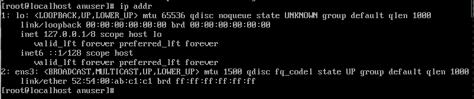
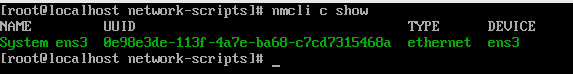
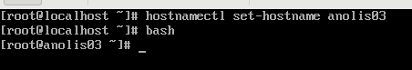

# 环境搭建

## 设备

* X99F8D主板
* Intel(R) Xeon(R) CPU E5-2680 v4 @ 2.40GHz * 2 = 28核心56线程
* 1T + 2T + 1T + 1T + 8T
* 64G DDR4

## 软件

* Rocky Linux 8.4 + GNOME + VNC
* qemu/kvm + libvirt
* OpenVswitch

## 社区

* <https://openanolis.cn/>


## 镜像

* <https://mirrors.openanolis.cn/anolis/8.4/isos/GA/x86_64/AnolisOS-8.4-x86_64-ANCK.qcow2>

```529cff12af73591b4e2b5ab9c5a2d180  AnolisOS-8.4-x86_64-ANCK.qcow2```

## 安装方式


### 创建虚拟机环境


工作目录创建三个文件夹，拷贝下列XML模板及脚本

```
mkdir anolis8.4-01  anolis8.4-02  anolis8.4-03
```

### virsh xml模板


```
<domain type='kvm'>
  <name>NAME</name>
  <memory unit='KiB'>4194304</memory>
  <currentMemory unit='KiB'>4194304</currentMemory>
  <vcpu placement='static'>8</vcpu>
  <resource>
    <partition>/machine</partition>
  </resource>
  <os>
    <type arch='x86_64' machine='pc-i440fx-rhel7.6.0'>hvm</type>
    <boot dev='hd'/>
    <bootmenu enable='no'/>
  </os>
  <features>
    <acpi/>
    <apic/>
    <hyperv>
      <relaxed state='on'/>
      <vapic state='on'/>
      <spinlocks state='on' retries='8191'/>
    </hyperv>
    <vmport state='off'/>
  </features>
  <cpu mode='custom' match='exact' check='full'>
    <model fallback='forbid'>Broadwell-IBRS</model>
    <vendor>Intel</vendor>
    <feature policy='require' name='vme'/>
    <feature policy='require' name='ss'/>
    <feature policy='require' name='vmx'/>
    <feature policy='require' name='pdcm'/>
    <feature policy='require' name='f16c'/>
    <feature policy='require' name='rdrand'/>
    <feature policy='require' name='hypervisor'/>
    <feature policy='require' name='arat'/>
    <feature policy='require' name='tsc_adjust'/>
    <feature policy='require' name='umip'/>
    <feature policy='require' name='md-clear'/>
    <feature policy='require' name='stibp'/>
    <feature policy='require' name='arch-capabilities'/>
    <feature policy='require' name='ssbd'/>
    <feature policy='require' name='xsaveopt'/>
    <feature policy='require' name='pdpe1gb'/>
    <feature policy='require' name='abm'/>
    <feature policy='require' name='ibpb'/>
    <feature policy='require' name='ibrs'/>
    <feature policy='require' name='amd-stibp'/>
    <feature policy='require' name='amd-ssbd'/>
    <feature policy='require' name='skip-l1dfl-vmentry'/>
    <feature policy='require' name='pschange-mc-no'/>
  </cpu>
  <clock offset='localtime'>
    <timer name='rtc' tickpolicy='catchup'/>
    <timer name='pit' tickpolicy='delay'/>
    <timer name='hpet' present='no'/>
    <timer name='hypervclock' present='yes'/>
  </clock>
  <on_poweroff>destroy</on_poweroff>
  <on_reboot>restart</on_reboot>
  <on_crash>destroy</on_crash>
  <pm>
    <suspend-to-mem enabled='no'/>
    <suspend-to-disk enabled='no'/>
  </pm>
  <devices>
    <emulator>/usr/sbin/qemu-system-x86_64</emulator>
    <disk type='file' device='disk'>
      <driver name='qemu' type='qcow2'/>
      <source file='SYS' index='1'/>
      <target dev='sda' bus='sata'/>
    </disk>
    <disk type='file' device='disk'>
      <driver name='qemu' type='qcow2'/>
      <source file='DATA' index='2'/>
      <target dev='sdb' bus='sata'/>
    </disk>
    <controller type='usb' index='0' model='qemu-xhci' ports='15'>
      <alias name='usb'/>
      <address type='pci' domain='0x0000' bus='0x00' slot='0x04' function='0x0'/>
    </controller>
    <controller type='pci' index='0' model='pci-root'>
      <alias name='pci.0'/>
    </controller>
    <controller type='sata' index='0'>
      <alias name='sata0'/>
      <address type='pci' domain='0x0000' bus='0x00' slot='0x05' function='0x0'/>
    </controller>
    <controller type='virtio-serial' index='0'>
      <alias name='virtio-serial0'/>
      <address type='pci' domain='0x0000' bus='0x00' slot='0x06' function='0x0'/>
    </controller>
    <controller type='ide' index='0'>
      <alias name='ide'/>
      <address type='pci' domain='0x0000' bus='0x00' slot='0x01' function='0x1'/>
    </controller>
    <interface type='bridge'>
      <source bridge='br0'/>
      <virtualport type='openvswitch'/>
      <target dev='vnet20'/>
      <model type='e1000'/>
      <alias name='net0'/>
      <address type='pci' domain='0x0000' bus='0x00' slot='0x03' function='0x0'/>
    </interface>
    <serial type='pty'>
      <source path='/dev/pts/23'/>
      <target type='isa-serial' port='0'>
        <model name='isa-serial'/>
      </target>
      <alias name='serial0'/>
    </serial>
    <console type='pty' tty='/dev/pts/23'>
      <source path='/dev/pts/23'/>
      <target type='serial' port='0'/>
      <alias name='serial0'/>
    </console>
    <channel type='spicevmc'>
      <target type='virtio' name='com.redhat.spice.0' state='disconnected'/>
      <alias name='channel0'/>
      <address type='virtio-serial' controller='0' bus='0' port='1'/>
    </channel>
    <input type='tablet' bus='usb'>
      <alias name='input0'/>
      <address type='usb' bus='0' port='1'/>
    </input>
    <input type='mouse' bus='ps2'>
      <alias name='input1'/>
    </input>
    <input type='keyboard' bus='ps2'>
      <alias name='input2'/>
    </input>
    <graphics type='spice' port='5922' autoport='yes' listen='127.0.0.1'>
      <listen type='address' address='127.0.0.1'/>
      <image compression='off'/>
    </graphics>
    <video>
      <model type='qxl' ram='65536' vram='65536' vgamem='16384' heads='1' primary='yes'/>
      <alias name='video0'/>
      <address type='pci' domain='0x0000' bus='0x00' slot='0x02' function='0x0'/>
    </video>
    <redirdev bus='usb' type='spicevmc'>
      <alias name='redir0'/>
      <address type='usb' bus='0' port='2'/>
    </redirdev>
    <redirdev bus='usb' type='spicevmc'>
      <alias name='redir1'/>
      <address type='usb' bus='0' port='3'/>
    </redirdev>
    <memballoon model='virtio'>
      <alias name='balloon0'/>
      <address type='pci' domain='0x0000' bus='0x00' slot='0x07' function='0x0'/>
    </memballoon>
  </devices>
  <seclabel type='dynamic' model='dac' relabel='yes'>
    <label>+0:+0</label>
    <imagelabel>+0:+0</imagelabel>
  </seclabel>
</domain>
```

### 初始化qcow2脚本

注意：qcow2镜像存放在 /data/img/mirrors.openanolis.cn/AnolisOS-8.4-x86_64-ANCK.qcow2

```
#!/bin/bash

TIME=`date +"%Y-%m-%d:%H:%M:%S"`

if [ -f AnolisOS-8.4-x86_64-ANCK.qcow2 ];then
	echo "Already exists AnolisOS-8.4-x86_64-ANCK.qcow2"
	exit 1
fi

cp /data/img/mirrors.openanolis.cn/AnolisOS-8.4-x86_64-ANCK.qcow2 .
qemu-img snapshot -l AnolisOS-8.4-x86_64-ANCK.qcow2
md5sum AnolisOS-8.4-x86_64-ANCK.qcow2
qemu-img snapshot -c "${TIME}" AnolisOS-8.4-x86_64-ANCK.qcow2
qemu-img create -f qcow2 data.qcow2 500G
qemu-img snapshot -c "${TIME}" data.qcow2

echo "All done!"
```


### 定义vm脚本

注意：qcow2镜像存放在 /data/img/mirrors.openanolis.cn/AnolisOS-8.4-x86_64-ANCK.qcow2

```
#!/bin/bash

WORKDIR=`pwd`
TIME=`date +"%Y-%m-%d:%H:%M:%S"`
NAME=`basename ${WORKDIR}`
SYS=${WORKDIR}/AnolisOS-8.4-x86_64-ANCK.qcow2
DATA=${WORKDIR}/data.qcow2

if [ ! -f AnolisOS-8.4-x86_64-ANCK.qcow2 ];then
	echo "No sys.qcow2 found!"
	exit 1
fi

if [ ! -f data.qcow2 ];then
	echo "No data.qcow2 found!"
	exit 1
fi

if [ ! -f template.anolis ];then
	echo "No anolist.template found!"
	exit 1
fi

cp template.anolis ${NAME}.xml -a

sed -i "s#NAME#${NAME}#g" ${NAME}.xml
sed -i "s#SYS#${SYS}#g" ${NAME}.xml
sed -i "s#DATA#${DATA}#g" ${NAME}.xml

virsh define ${NAME}.xml


echo "All done!"
```


### 启动VM脚本

注意：qcow2镜像存放在 /data/img/mirrors.openanolis.cn/AnolisOS-8.4-x86_64-ANCK.qcow2


```
#!/bin/bash

WORKDIR=`pwd`
TIME=`date +"%Y-%m-%d:%H:%M:%S"`
NAME=`basename ${WORKDIR}`
SYS=${WORKDIR}/AnolisOS-8.4-x86_64-ANCK.qcow2
DATA=${WORKDIR}/data.qcow2

if [ ! -f AnolisOS-8.4-x86_64-ANCK.qcow2 ];then
	echo "No sys.qcow2 found!"
	exit 1
fi

if [ ! -f data.qcow2 ];then
	echo "No data.qcow2 found!"
	exit 1
fi


virsh start ${NAME}

echo "All done!"
```


### 销毁VM脚本

```
#!/bin/bash

WORKDIR=`pwd`
TIME=`date +"%Y-%m-%d:%H:%M:%S"`
NAME=`basename ${WORKDIR}`
SYS=${WORKDIR}/AnolisOS-8.4-x86_64-ANCK.qcow2
DATA=${WORKDIR}/data.qcow2

if [ ! -f AnolisOS-8.4-x86_64-ANCK.qcow2 ];then
	echo "No sys.qcow2 found!"
	exit 1
fi

if [ ! -f data.qcow2 ];then
	echo "No data.qcow2 found!"
	exit 1
fi


virsh destroy ${NAME}
virsh undefine ${NAME}

echo "All done!"
```


### 创建虚拟机


```
0.init.sh  1.define.sh  2.start.sh  3.undefine.sh
```

* 依次执行0、1、2脚本，创建qcow2镜像并启动虚拟机。
* 虚机名称为当前目录名 NAME=`basename ${WORKDIR}`


* 安排三个虚拟机用于测试
* 每个虚拟机都配置了快照，随时回退，随意玩耍~

## 登陆VM

* 建议安排个图形界面，我是用VNC Viewer登陆玩耍的
* 没有图形界面的话，默认网卡是不起用的，console也没有开，怎么玩？你需要挂载qcow2，直接修改rootfs才行
* 还有什么好办法？


* <https://mirrors.openanolis.cn/anolis/8.4/isos/GA/ReadMe.txt>
* 官方README有给账号密码 镜像缺省sudo用户anuser,对应登录密码是anolisos


直接sudo进去修改root密码，对于爱玩用户，直接root是最直接的，虽然某些神仙要批评姿势不对

```
[root@anolis03 ~]# uname -a
Linux anolis03 4.19.91-23.4.an8.x86_64 #1 SMP Fri Apr 30 14:39:15 CST 2021 x86_64 x86_64 x86_64 GNU/Linux
```



默认没有ip地址




nmcli 是 NetworkManager的狗崽子，网卡配置都可通过该工具



修改主机名


修改sshd root登陆，默认root无法登陆，安全考虑，不过既然是玩耍，那就怎么hi怎么搞


```
sed -i 's/enabled=0/enabled=1/g' /etc/yum.repos.d/*.repo
yum makecache
yum install -y wget curl git tar tree htop \
  glances net-tools rpm-build yum-utils
```

* 启用所有repo仓库，更新软件源，安装必要玩耍软件
* 再配上花里胡哨的bash配置

```

cat >> ~/.bashrc << EOF
# github.com/yifengyou/bash
alias egrep='egrep --color=auto'
alias fgrep='fgrep --color=auto'
alias grep='grep --color=auto'
alias l.='ls -d .* -a --color=auto'
alias ll='ls -l -h -a --color=auto'
alias ls='ls -a --color=auto'
alias cp='cp -i'
alias mv='mv -i'
alias rm='rm -i'
alias xzegrep='xzegrep --color=auto'
alias xzfgrep='xzfgrep --color=auto'
alias xzgrep='xzgrep --color=auto'
alias zegrep='zegrep --color=auto'
alias zfgrep='zfgrep --color=auto'
alias zgrep='zgrep --color=auto'
alias push='git push'


# History setting
export PROMPT_COMMAND="history -a"
export HISTTIMEFORMAT="%F %T "
export HISTSIZE=10000

# Proxy settings
#export http_proxy='127.0.0.1:5050'
#export https_proxy='127.0.0.1:5050'
#export ftp_proxy='127.0.0.1:5050'

#export http_proxy=
#export https_proxy=
#export ftp_proxy=

# PS1 settings
# PS1='[\u@\h \w]\$ '
# \u ：当前用户的账号名称
# \h ：仅取主机的第一个名字
# \w ：完整的工作目录名称。家目录会以 ~代替
# \$ ：提示字符，如果是root时，提示符为：# ，普通用户则为：$
# \d ：代表日期，格式为weekday month date，例如："Mon Aug 1"
# \H ：完整的主机名称
# \t ：显示时间为24小时格式，如：HH:MM:SS
# \T ：显示时间为12小时格式
# \A ：显示时间为24小时格式：HH:MM
# \v ：BASH的版本信息
# \W ：利用basename取得工作目录名称，所以只会列出最后一个目录
# \# ：下达的第几个命令

# \[\e[38;40m\] 黑色
# \[\e[31;40m\] 红色
# \[\e[32;40m\] 绿色
# \[\e[33;40m\] 黄色
# \[\e[34;40m\] 蓝色
# \[\e[35;40m\] 紫红色
# \[\e[36;40m\] 青蓝色
# \[\e[37;40m\] 白色
# \[\e[0m\] 重置
# 此处设置\u 红色 \h 紫红色 \w 青蓝色 \$ 白色

PS1='\[\e[32;1m\][\[\e[31;1m\]\u\[\e[33;1m\]@\[\e[35;1m\]\h\[\e[36;1m\] \w\[\e[32;1m\]]\[\e[37;1m\]#\[\e[0m\] '

EOF
```


 

---
