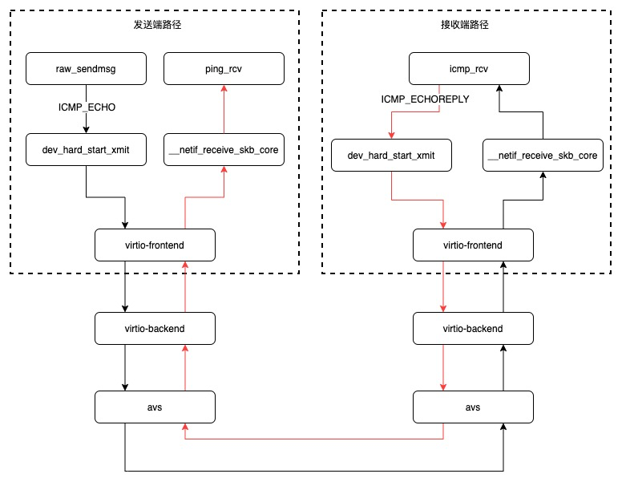
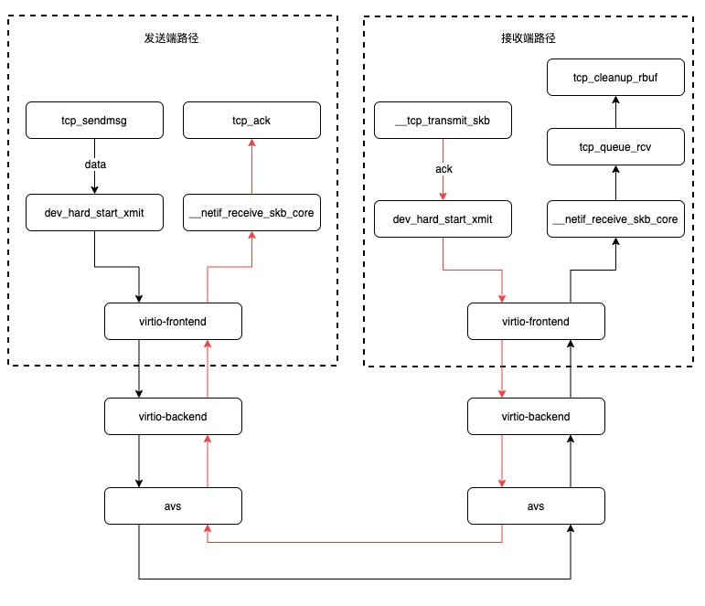

# rtrace-delay 网络抖动诊断

rtrace-delay是一款基于eBPF的网络抖动诊断工具，目前icmp（ping）、tcp等协议的网络抖动。


## 原理简介

一般地，网络抖动问题定位过程包括：

1. 确定是抖动发生在发送端还是接收端；
2. 确定是否在内核；
3. 确定导致抖动的代码片段；

为了确定抖动发生在发送端还是接收端，rtrace将一个完整的报文路径分成两个部分：**发送端报文路径和接收端报文路径**。

为了确定抖动是否发生在内核，rtrace在**内核出入口处的地方进行打点监控**。

为了确定导致抖动的代码片段，rtrace实现了动态打点功能，即可以随时**新增打点函数**，进而逐步缩减抖动范围。

接下来从这三点出发，介绍ping报文和tcp报文的抖动诊断方案。

### icmp（ping）抖动诊断

下图是ping的ICMP_ECHO和ICMP_ECHOREPLY报文路径。黑色箭头是ICMP_ECHO报文路径，红色箭头是ICMP_ECHOREPLY报文路径。

其中，发送端报文路径包括：ICMP_ECHO报文发送路径及ICMP_ECHOREPLY报文接收路径：

* ICMP_ECHO报文发送路径是：raw_sendmsg->dev_hard_start_xmit->驱动；
* ICMP_ECHOREPLY报文接收路径：驱动->__netif_receive_skb_core->ping_rcv->ping_recvmsg。

其中，接收端报文路径包括：ICMP_ECHO报文接收路径及ICMP_ECHOREPLY报文发送路径：

* ICMP_ECHO报文接收路径：驱动->__netif_receive_skb_core->icmp_rcv；
* ICMP_ECHOREPLY报文发送路径：dev_hard_start_xmit->驱动。



### tcp抖动诊断原理

下图是tcp的数据报文和ack报文路径，黑色箭头是数据报文路径，红色箭头是ack报文路径。

发送端报文路径包括：报文发送路径及ack报文接收路径。

* 报文发送路径是：tcp_sendmsg->dev_hard_start_xmit->驱动；
* ack报文接收路径是：驱动->__netif_receive_skb_core->tcp_ack；

接收端报文路径包括：报文接收路径及ack报文发送路径。

* 报文接收路径包括：驱动->__netif_receive_skb_core->tcp_queue_rcv->tcp_cleanup_rbuf；
* ack报文发送路径是：__tcp_transmit_skb->驱动->__netif_receive_skb_core->驱动；



## 使用说明

使用流程：

1. 生成配置文件：通过命令`sysak rtrace-delay --gen ./config`生成toml配置文件到config目录下；
2. 修改配置文件：根据自己的需要修改配置；
3. 运行诊断程序，可输入的参数如下：

```shell
OPTIONS:
        --config <config>      configuration file path
        --delay <delay>        show packet routine when delay > DELAY(ms) [default: 200]
        --gen <gen>            generate default configuration file
        --latency <latency>    latency(ms) in processing data [default: 3000]
```

### 配置文件

配置文件包含三个配置表，分别是基础配置表、过滤器配置表和函数配置表。

#### 基础配置表

`basic`包含六种键值，分别是：

* debug：是否开启debug日志输出；
* btf_path：vmlinux btf文件的路径；
* duration：程序运行时间；
* protocol：协议类型，目前包含icmp、tcp和tcp-syn；
* recv：诊断发送端路径还是接收端路径；
* vmlinux：debuginfo中vmlinux的路径。

```toml
[basic]
debug = false
btf_path = ""
duration = 0
protocol = "icmp"
recv = true
vmlinux = ""
```

其中，`btf_path`和`vmlinux`是可选参数。

目前提供了五个默认的配置文件，分别是：`ping-sender.toml`、`ping-receiver.toml`、`syn-sender.toml`、`tcp-sender.toml`和`tcp-receiver.toml`。

#### 过滤器配置表

`filter`是数组形式，单个`filter`内部过滤规则取交集，`filter`间过滤规则取并集。`filter`支持三种键值，分别是：

* pid：进程id；
* dst：目的地址，包含ip和端口；
* src：源地址，包含ip和端口。

```toml
[[filter]]
pid = 0
dst = "0.0.0.0:0"
src = "0.0.0.0:0"
```

#### 函数配置表

函数配置表中`function`是数组形式。`function`目前支持五种键值，分别是：

* name：打点的内核函数名字；
* enable：是否使能；
* params：内置参数列表；
* exprs：动态参数表达式列表；
* line：指定打点行数。

```toml
[[function]]
name = "raw_sendmsg"
enable = true
params = ["basic"]
lines = ["net/ipv4/raw.c:455"]

[[function]]
name = "dev_hard_start_xmit"
enable = true
params = ["basic"]

[[function]]
name = "__netif_receive_skb_core"
enable = true
params = ["basic"]
```

### icmp（ping）抖动诊断

#### 步骤一

运行`sysak rtrace-delay --gen ./config`生成toml配置文件到config目录下。这里我们主要关注`./config/ping-sender.toml`和`./config/ping-receiver.toml`两个配置文件。

#### 步骤二：

根据需求修改配置文件

#### 步骤三

* 诊断发送端路径，`sysak rtrace-delay --config ./config/ping-sender.toml --delay 20 --latency 1000`；
* 诊断接收端路径，`sysak rtrace-delay --config ./config/ping-receiver.toml`；

下面是诊断发送端路径的输出，执行的命令是`sysak rtrace-delay --config ./config/ping-sender.toml --delay 20 --latency 1000`。表示延迟1秒处理数据，打印抖动超过20毫秒的报文路径：

```plain
      (0,1)raw_sendmsg+0                       (0,1)ping_rcv+0        
              ↓                                       ↑                         
             33us                                    43us                       
              ↓                                       ↑                         
  (0,1)dev_hard_start_xmit+0  →27479us→ (0,1)__netif_receive_skb_core+0
```

### tcp抖动诊断

#### 步骤一

运行`sysak rtrace-delay --gen ./config`生成toml配置文件到config目录下。这里我们主要关注`./config/ping-sender.toml`和`./config/ping-receiver.toml`两个配置文件。

#### 步骤二：

根据需求修改配置文件

#### 步骤三

* 诊断syn报文发送端路径，命令是`sysak rtrace-delay --config ./config/syn-sender.toml --delay 0 --latency 1000`，下面是样例输出；

```shell
FUNCTION DELAY: 11.160.62.52:57580 - 100.67.130.98:80

    (0,0)__ip_queue_xmit+0               (0,1)tcp_rcv_state_process+0 
              ↓                                       ↑                         
             48us                                    39us                       
              ↓                                       ↑                         
  (0,0)dev_hard_start_xmit+0  →27662us→ (0,1)__netif_receive_skb_core+0
```

* 诊断tcp数据报文发送端路径，命令是`sysak rtrace-delay --config ./config/tcp-sender.toml --delay 0 --latency 1000`，下面是样例输出；

```shell
FUNCTION DELAY: 127.0.0.1:36360 - 127.0.0.1:30197

     (0,20)tcp_sendmsg+0      
              ↓                         
             18us                       
              ↓                         
   (0,20)__ip_queue_xmit+0                     (0,20)tcp_ack+0        
              ↓                                       ↑                         
             12us                                    6us                        
              ↓                                       ↑                         
 (0,20)dev_hard_start_xmit+0   →2342us→ (0,20)__netif_receive_skb_core+0
```

* 诊断tcp数据报文接收端路径，`sysak rtrace-delay --config ./config/tcp-receiver.toml --delay 0 --latency 1000`，下面是样例输出；

```shell
FUNCTION DELAY: 127.0.0.1:36362 - 127.0.0.1:30197

(0,21)__netif_receive_skb_core+0             (0,21)tcp_cleanup_rbuf+0   
              ↓                                       ↑                         
             5us                                     28us                       
              ↓                                       ↑                         
 (0,21)tcp_rcv_established+0             (0,21)dev_hard_start_xmit+0  
              ↓                                       ↑                         
             6us                                     6us                        
              ↓                                       ↑                         
    (0,21)tcp_queue_rcv+0       →14us→     (0,21)__ip_queue_xmit+0   
```